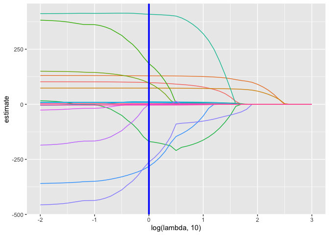

statistical_learning
================

``` r
bwt_df = 
  read_csv("./data/birthweight.csv") %>% 
  janitor::clean_names() %>%
  mutate(
    babysex = as.factor(babysex),
    babysex = fct_recode(babysex, "male" = "1", "female" = "2"),
    frace = as.factor(frace),
    frace = fct_recode(frace, "white" = "1", "black" = "2", "asian" = "3", 
                       "puerto rican" = "4", "other" = "8"),
    malform = as.logical(malform),
    mrace = as.factor(mrace),
    mrace = fct_recode(mrace, "white" = "1", "black" = "2", "asian" = "3", 
                       "puerto rican" = "4")) %>% 
  sample_n(200)
```

``` r
x = model.matrix(bwt ~ ., bwt_df)[,-1]
y = bwt_df$bwt
```

``` r
lambda = 10^(seq(3, -2, -0.1))

lasso_fit =
  glmnet(x, y, lambda = lambda)

lasso_cv =
  cv.glmnet(x, y, lambda = lambda)

lambda_opt = lasso_cv$lambda.min
```

``` r
broom::tidy(lasso_fit) %>% 
  select(term, lambda, estimate) %>% 
  complete(term, lambda, fill = list(estimate = 0) ) %>% 
  filter(term != "(Intercept)") %>% 
  ggplot(aes(x = log(lambda, 10), y = estimate, group = term, color = term)) + 
  geom_path() + 
  geom_vline(xintercept = log(lambda_opt, 10), color = "blue", size = 1.2) +
  theme(legend.position = "none")
```

    ## Warning: Using `size` aesthetic for lines was deprecated in ggplot2 3.4.0.
    ## ℹ Please use `linewidth` instead.

<!-- -->

``` r
broom::tidy(lasso_cv) %>% 
  ggplot(aes(x = log(lambda, 10), y = estimate)) + 
  geom_point()  
```

<!-- -->

``` r
lasso_fit = 
  glmnet(x, y, lambda = lambda_opt)

lasso_fit %>% broom::tidy()
```

    ## # A tibble: 18 × 5
    ##    term               step  estimate lambda dev.ratio
    ##    <chr>             <dbl>     <dbl>  <dbl>     <dbl>
    ##  1 (Intercept)           1 -6443.         1     0.720
    ##  2 babysexfemale         1    98.4        1     0.720
    ##  3 bhead                 1   129.         1     0.720
    ##  4 blength               1    73.4        1     0.720
    ##  5 delwt                 1     0.929      1     0.720
    ##  6 fincome               1     1.11       1     0.720
    ##  7 fraceblack            1   185.         1     0.720
    ##  8 fraceasian            1    97.0        1     0.720
    ##  9 fracepuerto rican     1  -169.         1     0.720
    ## 10 gaweeks               1     7.99       1     0.720
    ## 11 malformTRUE           1   408.         1     0.720
    ## 12 menarche              1     8.75       1     0.720
    ## 13 mheight               1    11.6        1     0.720
    ## 14 momage                1     8.09       1     0.720
    ## 15 mraceblack            1  -263.         1     0.720
    ## 16 mraceasian            1  -282.         1     0.720
    ## 17 smoken                1    -3.90       1     0.720
    ## 18 wtgain                1     3.04       1     0.720
