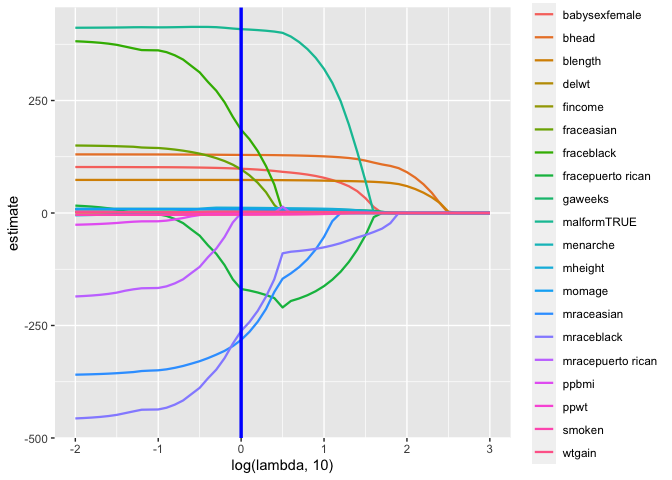
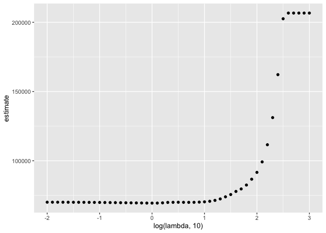

Statistical Learning
================
Jingyi Yao
2023-01-04

# LASSO

### Raw Data

``` r
df <- read_csv("./data/birthweight.csv") 
```

    ## Rows: 4342 Columns: 20
    ## ── Column specification ────────────────────────────────────────────────────────
    ## Delimiter: ","
    ## dbl (20): babysex, bhead, blength, bwt, delwt, fincome, frace, gaweeks, malf...
    ## 
    ## ℹ Use `spec()` to retrieve the full column specification for this data.
    ## ℹ Specify the column types or set `show_col_types = FALSE` to quiet this message.

``` r
head(df)
```

    ## # A tibble: 6 × 20
    ##   babysex bhead blength   bwt delwt fincome frace gaweeks malform menarche
    ##     <dbl> <dbl>   <dbl> <dbl> <dbl>   <dbl> <dbl>   <dbl>   <dbl>    <dbl>
    ## 1       2    34      51  3629   177      35     1    39.9       0       13
    ## 2       1    34      48  3062   156      65     2    25.9       0       14
    ## 3       2    36      50  3345   148      85     1    39.9       0       12
    ## 4       1    34      52  3062   157      55     1    40         0       14
    ## 5       2    34      52  3374   156       5     1    41.6       0       13
    ## 6       1    33      52  3374   129      55     1    40.7       0       12
    ## # … with 10 more variables: mheight <dbl>, momage <dbl>, mrace <dbl>,
    ## #   parity <dbl>, pnumlbw <dbl>, pnumsga <dbl>, ppbmi <dbl>, ppwt <dbl>,
    ## #   smoken <dbl>, wtgain <dbl>

### Data Cleaning + Sampling

- `as.factor()` : change dbl into fct, change variable type to use
  `fct_recode()`
- `fct_recode(column, "new_value" = "old_value")` change factor level
- `as.logical()` change 0 or 1 into FALSE or TRUE
- `sample_n(sample size)` sample from the cleaned data set

``` r
bwt_df = 
  read_csv("./data/birthweight.csv") %>% 
  janitor::clean_names() %>%
  mutate(
    babysex = as.factor(babysex),
    babysex = fct_recode(babysex, "male" = "1", "female" = "2"),
    frace = as.factor(frace),
    frace = fct_recode(frace, "white" = "1", "black" = "2", "asian" = "3", 
                       "puerto rican" = "4", "other" = "8"),
    malform = as.logical(malform),
    mrace = as.factor(mrace),
    mrace = fct_recode(mrace, "white" = "1", "black" = "2", "asian" = "3", 
                       "puerto rican" = "4")) %>% 
  sample_n(200)  # get a sample of size 200
```

### Create Design Matrix

- **glmnet** package predates tidyverse. It needs a design matrix (only
  contains X)

- `model.matrix(formula = y ~ x, data = df)` can generate an expanded
  design matrix by expanding factors to a set of dummy variables
  (depending on the contrasts) and expanding interactions similarly.

``` r
x = model.matrix(bwt ~ ., bwt_df)[,-1]

y = bwt_df$bwt
```

### Grid Search for BEST Lambda

- set lambda as a vector, and fit lasso model for each lambda
- use cross validation to find the best lambda
- `cv.glmnet(x, y, lambda, weights, nfolds = 10)` 10-fold CV by default
- `glmnet(x,y,lambda, alpha = 1)` alpha = 1 by default : LASSO
  regression

``` r
lambda = 10^(seq(3, -2, -0.1))      # a vector of lambdas

lasso_fit =
  glmnet(x, y, lambda = lambda,alpha = 1)     # glmnet() with alpha = 1 : lasso

lasso_cv =
  cv.glmnet(x, y, lambda = lambda)  # cross validate lasso model

lasso_cv
```

    ## 
    ## Call:  cv.glmnet(x = x, y = y, lambda = lambda) 
    ## 
    ## Measure: Mean-Squared Error 
    ## 
    ##     Lambda Index Measure   SE Nonzero
    ## min   1.00    31   69465 6964      17
    ## 1se  31.62    16   75668 6849      12

``` r
lambda_opt = lasso_cv$lambda.min    # the lambda with the minimum MSE
lambda_opt
```

    ## [1] 1

``` r
cvm <- lasso_cv$cvm
cvm
```

    ##  [1] 206646.03 206646.03 206646.03 206646.03 206646.03 202539.45 162192.17
    ##  [8] 131185.02 111599.69  99227.06  91642.16  86717.27  82511.20  79690.94
    ## [15]  77893.19  75667.92  74015.03  72492.61  71446.76  70795.00  70400.51
    ## [22]  70180.18  70037.58  70011.82  70034.14  70084.39  70034.77  69956.57
    ## [29]  69658.36  69487.86  69464.73  69490.50  69555.23  69602.96  69666.37
    ## [36]  69719.25  69764.02  69812.17  69857.47  69897.98  69941.66  69980.59
    ## [43]  70012.90  70036.09  70061.10  70074.91  70089.75  70101.77  70111.83
    ## [50]  70119.89  70125.61

``` r
cvsd <- lasso_cv$cvsd
cvsd
```

    ##  [1] 24021.039 24021.039 24021.039 24021.039 24021.039 24733.002 20254.562
    ##  [8] 14872.909 11663.951  9805.789  8780.446  8237.523  7833.197  7429.923
    ## [15]  7087.098  6848.744  6859.944  6634.091  6520.682  6461.020  6445.533
    ## [22]  6445.779  6445.000  6488.735  6530.164  6574.376  6630.126  6700.812
    ## [29]  6853.190  6928.683  6964.285  6982.906  7000.104  6988.841  6984.520
    ## [36]  6985.028  6981.711  6989.734  7001.135  7010.979  7022.477  7032.530
    ## [43]  7040.862  7049.252  7052.711  7058.609  7061.326  7063.148  7064.423
    ## [50]  7065.139  7066.091

### Coefficients vs. Lambda

- `complete()` : fill in missing values?
- `log(lambda, 10)` : take log transformation
- `geom_path()` show the lines (trajectory) instead of scattered points
- `geom_vline(xintercept,color,size)` set color and size for the
  vertical line at xintercept

``` r
broom::tidy(lasso_fit) %>% 
  select(term, lambda, estimate) %>%  # select intercept and other predictors
  complete(term, lambda, fill = list(estimate = 0) ) %>% 
  filter(term != "(Intercept)") %>% 
  ggplot(aes(x = log(lambda, 10), y = estimate, group = term, color = term)) + 
  geom_path(size = .8) + 
  geom_vline(xintercept = log(lambda_opt, 10), color = "blue", size = 1.2)
```

<!-- -->

### CV Curve

``` r
broom::tidy(lasso_cv) %>% 
  ggplot(aes(x = log(lambda, 10), y = estimate)) + 
  geom_point()  
```

<!-- -->

### The OPTIMAL Model

- The LASSO result does not contain p-values : hard to do inference
- The estimation is different from OLS result using these selected
  predictors

``` r
lasso_fit = 
  glmnet(x, y, lambda = lambda_opt)

lasso_fit %>% broom::tidy()
```

    ## # A tibble: 18 × 5
    ##    term               step  estimate lambda dev.ratio
    ##    <chr>             <dbl>     <dbl>  <dbl>     <dbl>
    ##  1 (Intercept)           1 -6443.         1     0.720
    ##  2 babysexfemale         1    98.4        1     0.720
    ##  3 bhead                 1   129.         1     0.720
    ##  4 blength               1    73.4        1     0.720
    ##  5 delwt                 1     0.929      1     0.720
    ##  6 fincome               1     1.11       1     0.720
    ##  7 fraceblack            1   185.         1     0.720
    ##  8 fraceasian            1    97.0        1     0.720
    ##  9 fracepuerto rican     1  -169.         1     0.720
    ## 10 gaweeks               1     7.99       1     0.720
    ## 11 malformTRUE           1   408.         1     0.720
    ## 12 menarche              1     8.75       1     0.720
    ## 13 mheight               1    11.6        1     0.720
    ## 14 momage                1     8.09       1     0.720
    ## 15 mraceblack            1  -263.         1     0.720
    ## 16 mraceasian            1  -282.         1     0.720
    ## 17 smoken                1    -3.90       1     0.720
    ## 18 wtgain                1     3.04       1     0.720
